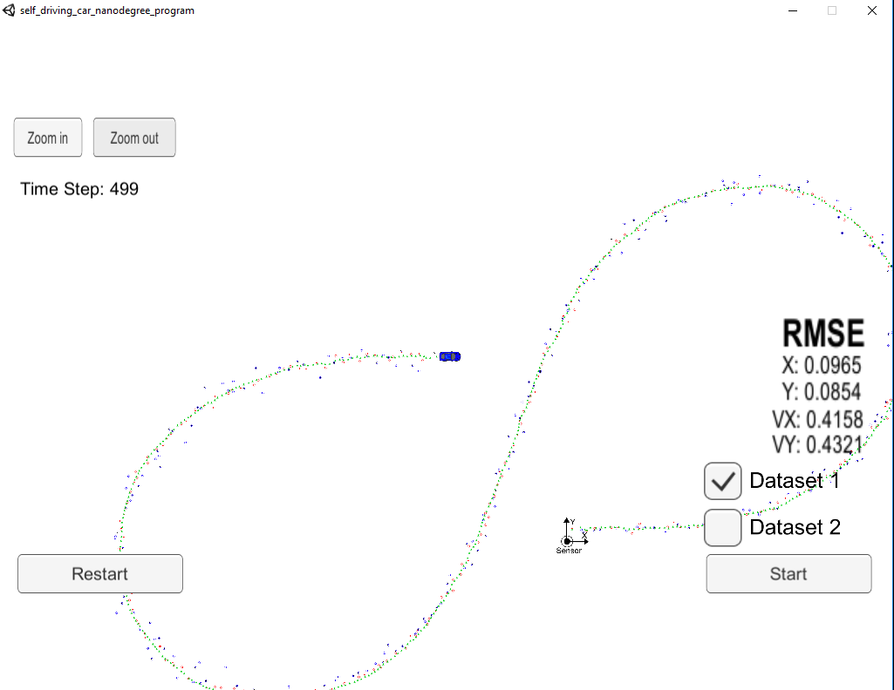
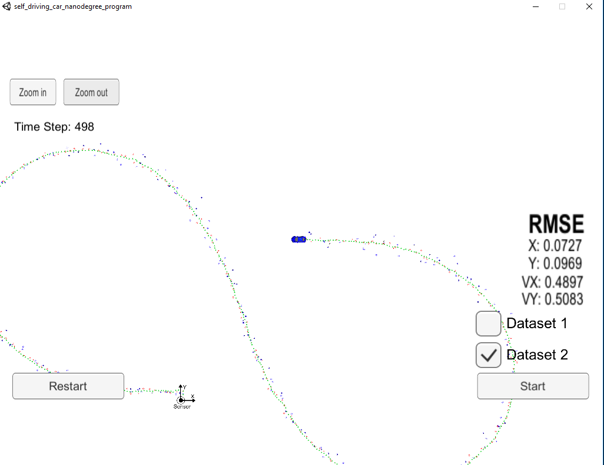

# Extended Kalman Filter Project 
## Self-Driving Car Engineer Nanodegree Program

### Tom Chmielenski
#### January 2018

----

In this project, I implemented a kalman filter to estimate the state of a moving object of interest with noisy lidar and radar measurements. Passing the project required obtaining RMSE values of that are lower that the tolerance outlined in the project rubric [0.11, 0.11, 0.52, 0.52] . 

Both datasets are within the rubric tolerances!

---

### Dataset 1 Results

### Dataset 2 Results

----

